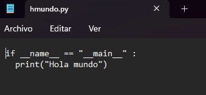
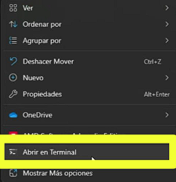
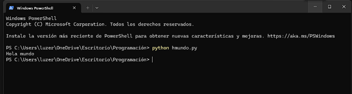
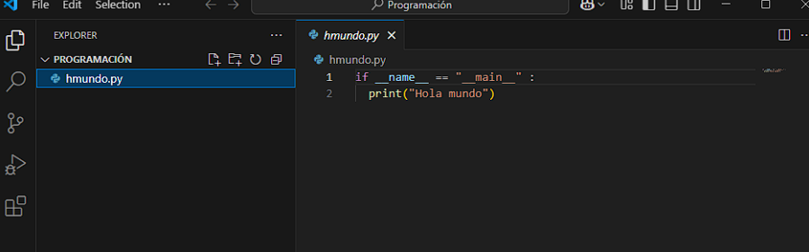
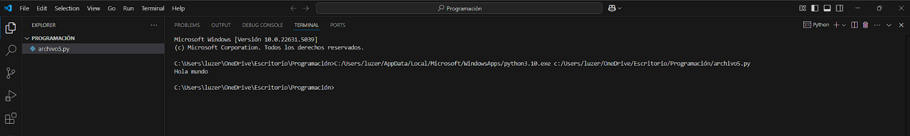
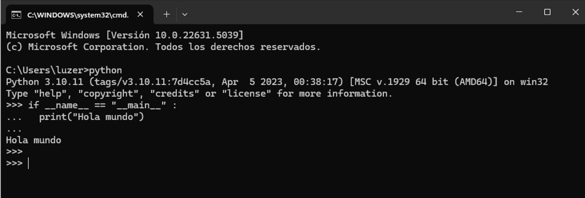

# REPORTE RETO 2 - HOLA MUNDO

## RESUMEN

Se buscó ejecutar el siguiente codigo:

if __name__ == "__main__" :
  print("Hola mundo") 
  
en tres formas diferentes:  bloc de notas, directamente en el linterprete de python y en vscode.

## 1.Herramientas
Primero, es necesario que el usuario cuente con las siguientes herramientas para el correcto desarrollo de la actividad:

-Phyton

-Visual Studio Coda (VSCode)

-Git
## 2.Ejecuciones

### A. Carpeta

Primero se crea una carpeta que va a ser fundamental para el procedimiento, en mi caso la nombré "PROGRAMACIÓN".

### B. Bloc de notas

Se abrió el bloc de notas que viene por defecto y se pegó el mismo código, luego se guardó el archivo con el nombre "hmundo.py" y se ubicó en la carpeta anteriormente creada.

Y dandole click derecho en la carpeta presionamos "abrir en terminal"

Ahora en el terminal escribiremos "python" seguido del nombre que le hemos puesto al bloc de notas, en este caso "hmundo" y le damos enter.

Nos debería quedar asi.

### C.vscode

Nos adentramos a nuestra carpeta nombrada "PROGRAMACION" y creamos un nuevo archivo con extención .py en el cual volvemos a pegar nuestro código.

Luego se ejecuta en el terminal.Nos debería quedar asi.

### D.Interprete Python

Abrimos el interprete python y copiamos el código, luego le damos enter 
Este es el más sencillo de todos.

Y finalmente damos por terminado nuestro objetivo de ejecutar el código en tres diferentes programas. 

### Sergio Olivares Martin.
